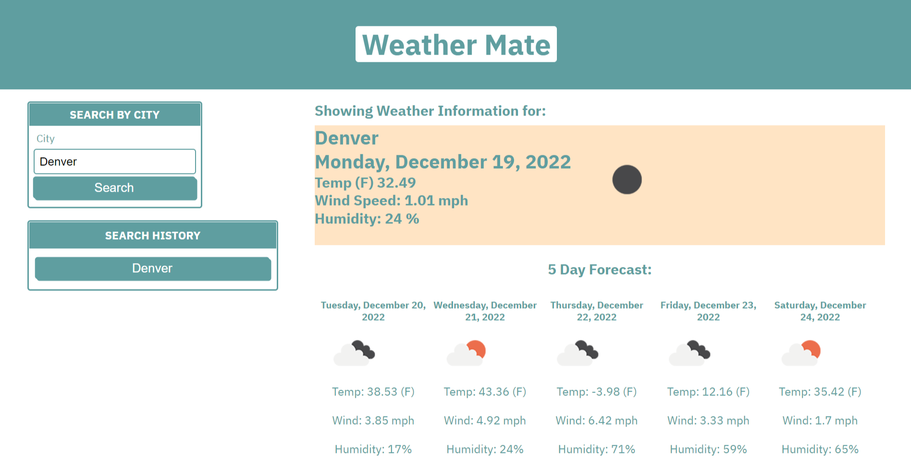

# WeatherMate

<h1>Welcome to WeatherMate! Here, you can real time updates for weather on a city of your choosing!</h1>
    <h3>Insert a city into the search bar and watch the magic happen</h3>

<h2>Links:</h2>
Link to page:
<a href="https://khernandez0810.github.io/WeatherMate/"> Link to webpage</a>

Link to Repository:
<a href="https://github.com/khernandez0810/WeatherMate"> Link to repository</a>

Screenshot example of page upon loading: 
